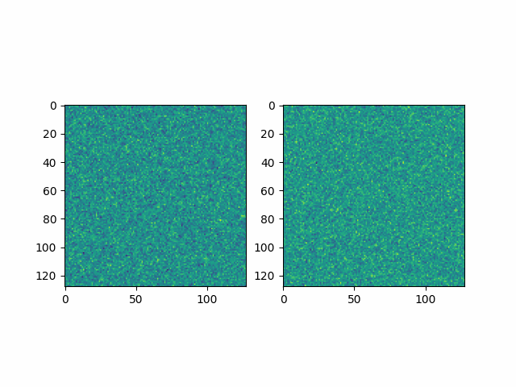
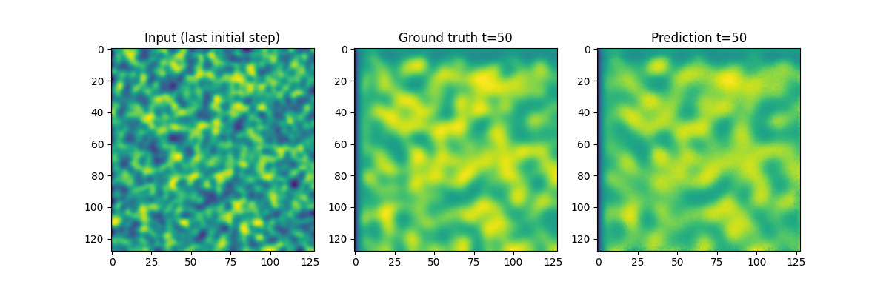
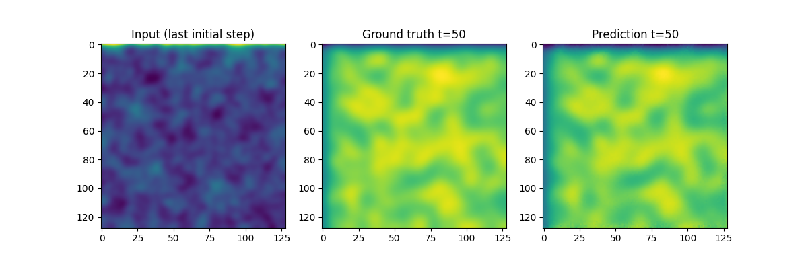
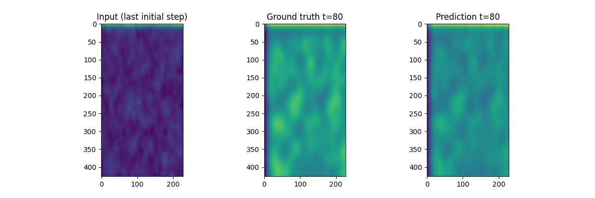

# Practical example of time-dependent Neumann boundary conditions for a Fourier Neural Operator

### Introduction

The Fourier Neural Operator (FNO) has become a prominent architecture for learning mappings between function spaces directly from data. However, the literature presents differing statements regarding the scope of its implementation. In a key reference, the authors emphasize that:

"In order to maintain a fast and memory-efficient method, our implementation of the Fourier neural operator relies on the fast Fourier transform which is only defined on uniform mesh discretizations of , or for functions on the square satisfying homogeneous Dirichlet (fast Fourier sine transform) or homogeneous Neumann (fast Fourier cosine transform) boundary conditions" (Kovachki et al., 2023).

Following this reasoning, the publicly available NeuralOperator library (Kossaifi et al., 2025), which uses FFT-based convolutions, would also be limited when applied to non-homogeneous Neumann boundary conditions.

Conversely, another paper dedicated to FNO methodology states that FNOs are not restricted to homogeneous domains and can incorporate heterogeneous geometries and boundary conditions (Duruisseaux et al., 2025). If I understand correctly, despite theoretical constraints of FFT-based solvers, FNOs may still perform adequately in practice when trained on non-homogeneous boundary conditions. An analogy may be drawn to the Nelder-Mead simplex algorithm, which lacks general convergence guarantees yet remains widely effective in applied settings.

To evaluate this in practice, I apply the FNO to a diffusion-reaction system with non-homogeneous boundary conditions and assess whether it can approximate the solution.

### Theoretical setup

#### PDE model

For the model, we modify the 2D diffusion–reaction model from PDEBench (Takamoto et al., 2024). The model is made of two non-linearly coupled functions, the activator \(u = u(t,x,y)\) and the inhibitor \(v = v(t,x,y)\). The diffusion-reaction equations are:

$$
\begin{aligned}
\partial_t u &= D_u \partial_{xx} u + D_u \partial_{yy} u + R_u(u,v), \\
\partial_t v &= D_v \partial_{xx} v + D_v \partial_{yy} v + R_v(u,v),
\end{aligned}
$$

where \(D_u\) and \(D_v\) are diffusion coefficients for the activator and inhibitor, respectively, and \(R_u = R_u(u,v)\) and \(R_v = R_v(u,v)\) are the reaction functions.

The domain is:

$$
\Omega = [-1,1]^2, \quad (x,y)\in\Omega,\quad t\in(0,5].
$$

We choose explicitly the reaction functions:

$$
\begin{aligned}
R_u(u,v) &= u - u^3 - k - v + D_u \Delta u, \\
R_v(u,v) &= u - v + D_v \Delta v,
\end{aligned}
$$

where \(k = 5 \times 10^{-3}\), \(D_u = 1 \times 10^{-3}\), and \(D_v = 5 \times 10^{-3}\).

The system is subject to time-dependent non-homogeneous Neumann boundary conditions:

For \(u\):

$$
\begin{cases}
D_u \partial_x u = -0.05 t, & x = -1, \\
D_u \partial_x u = 0, & x = 1, \\
D_u \partial_y u = 0, & y = -1, \\
D_u \partial_y u = 0, & y = 1,
\end{cases}
$$

For \(v\):

$$
\begin{cases}
D_v \partial_x v = 0, & x = -1, \\
D_v \partial_x v = 0, & x = 1, \\
D_v \partial_y v = 0, & y = -1, \\
D_v \partial_y v = 0.1 \sin(2t), & y = 1.
\end{cases}
$$

These explicitly introduce spatially uneven and time-varying fluxes, departing from the standard homogeneous Neumann case. Previous tests with constant flux already gave satisfactory performance, motivating this more challenging configuration.

#### Neural operator

Neural operators aim to learn the solution operator:

$$
G : A \to U, \quad f(\cdot) \mapsto g(\cdot),
$$

where \(f(\cdot)\) is the input function, \(g(\cdot)\) is the output function and \(A,U\) are Banach spaces. In our case, we aim to learn:

$$
G' :
\begin{pmatrix}
u(x,y,t) \\
v(x,y,t)
\end{pmatrix}
\longrightarrow
\begin{pmatrix}
u(x,y,t + \Delta t) \\
v(x,y,t + \Delta t)
\end{pmatrix},
$$

using two channels to represent \(u\) and \(v\). We actually input 10 frames and output 10 frames to get the best results.

We recall the Universal Approximation Theorem for FNOs (Valentin Duruisseaux, 2025): Let

$$
G : H^s(\mathbb{T}^d; \mathbb{R}^{d_a}) \to H^{s'}(\mathbb{T}^d; \mathbb{R}^{d_u})
$$

be a continuous operator, and let \(K \subset H^s(\mathbb{T}^d; \mathbb{R}^{d_a})\) be compact. Then, for every \(\varepsilon > 0\), there exists a Fourier Neural Operator \(N\) such that:

$$
\sup_{a \in K} \|G(a) - N(a)\|_{H^{s'}} \le \varepsilon.
$$

This is well posed in our case.

#### Theoretical problem

We employ a Fourier Neural Operator (FNO), in which convolution in Fourier space is performed after a lifting step. The NeuralOperator library implements this using the Fast Fourier Transform (Kossaifi et al., 2025), which implicitly assumes periodicity outside the computational domain. Homogeneous Neumann boundary conditions would correspond to an even cosine expansion, requiring:

$$
\partial_n u = \partial_n v = 0 \quad \text{on } \partial\Omega
$$

where \(n\) is the normal vector to the boundary. However, in our setup, the imposed boundary fluxes are non-zero and spatially non-uniform, so these theoretical assumptions are violated. The goal is therefore to assess on a concrete example whether the FFT-based FNO can still learn an accurate solution operator under such conditions.

### Dataset

The dataset dataset contains down sampled versions of simulation, with specification and of the theoretical setup given previously. Here is an example of a random sample in the dataset:

I generate 700 samples using the following modified rc_ode function from sim_diff_react.py in the PDEBench code, available in the file modified_rc_ode.py.

### Training

I generated a sample of size 700, and trained a model on 500 samples, with 50 for the test. We then calculate the result on the 150 lefts. I used those specifications with the model:

initial_steps = 10
future_steps = 10
batch_size = 4
n_epochs = 50
operator = FNO(
n_modes=(16,16,5),       # 3D Fourier modes: nx, ny, time
hidden_channels=32,
in_channels=dataset\[0\]\[0\].shape\[0\],  # number of input channels
out_channels=dataset\[0\]\[1\].shape\[0\]  # number of output channels
)

### Results

On 150 new samples, unseen during the training phase, the FNO got

Evaluation on last 150 samples:

MSE : 0.000208

MAE : 0.008181

R² : 0.995152

This is rather very impressive, confirming that FNO are able to learn time-dependent, so non-homogeneous, Neumann boundary conditions, as shown by a concrete example below for and 10 frames as input and 10 frames as output:

We can also try on discretization invariance, and we can see that it still holds for the following example with the same system but with grid size :

### Conclusion

There remains a lack of clarity regarding the theoretical scope of applicability of Fourier Neural Operators, particularly with respect to PDEs with non-homogeneous Neumann boundary conditions. From a strictly analytical perspective, the use of the fast Fourier transform imposes assumptions that exclude non-homogeneous boundary data. Nevertheless, the numerical experiments presented here indicate that the FNO framework can still perform effectively in practice, even in the presence of non-homogeneous and time-dependent boundary conditions. This apparent discrepancy may point to limitations or gaps in the current mathematical analysis of neural operators. Alternatively, as suggested in the introduction, this situation may be analogous to that of the Nelder–Mead simplex algorithm, whose convergence is not guaranteed theoretically but which remains widely and successfully used in practice.

### Bibliography

Jean Kossaifi, N. K.-S. (2025). _A Library for Learning Neural Operators._ Retrieved from arXiv:2412.10354

Makoto Takamoto, T. P. (2024). _PDEBENCH: An Extensive Benchmark for Scientific Machine Learning._ Retrieved from arXiv:2210.07182

Nikola Kovachki, Z. L. (2023). _Neural Operator: Learning Maps Between Function Spaces._ Retrieved from arXiv:2108.08481

Valentin Duruisseaux, J. K. (2025). _Fourier Neural Operators Explained: A Practical Perspective._ Retrieved from arXiv:2512.01421
